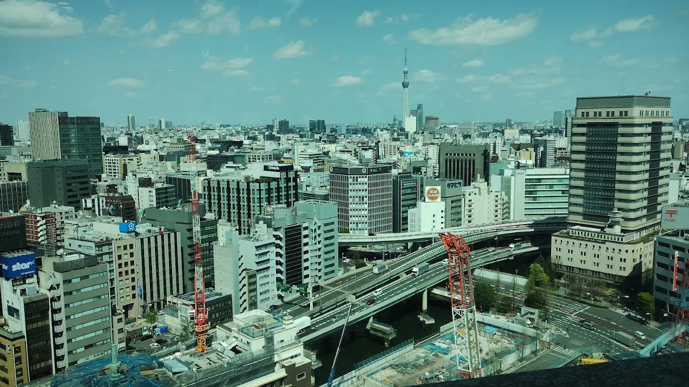

<!--- # riken-llm-workshop-2025 ---> 
<!--- img style='height: 100%; width: 100%; object-fit: contain' src="aip.png"/ --->

## Goal

This workshop aims to promote internal exchange and foster a research-oriented community within RIKEN-AIP, centered on shared interests in LLMs. It will also serve as a platform to encourage collaboration and understanding across teams. 

## Dates and Location

- Dates: October 2–3, 2025
- Location: RIKEN-AIP Open Space, Tokyo + Online (with verification)
- Accessibility: Open to all RIKEN-affiliated members

## Schedule

| Time      | Description |
| :---        |    :----:   |
| 9:50-10:00       | Welcome and opening remarks       |
| 10:00-10:30      | Speaker: XXX   Title: XXX       |
| 10:30-11:00      | Speaker: XXX   Title: XXX       |
| 11:00-11:30      | Tea Break  |
| 11:30-12:00      | Speaker: XXX   Title: XXX       |
| 12:00-12:30      | Speaker: XXX   Title: XXX       |
| 12:30-14:30      | Lunch and poster session       |
| 14:30-15:00      | Speaker: XXX   Title: XXX       |
| 15:00-15:30      | Speaker: XXX   Title: XXX       |
| 15:30-16:00      | Tea Break       |
| 16:00-16:30      | Speaker: XXX   Title: XXX       |
| 16:30-17:00      | Speaker: XXX   Title: XXX       |

## Organizers

**Contact the organizers**

## Acknowledgment

  
  

<!-- ## Resources for LLMs -->

<!-- TODO -->

